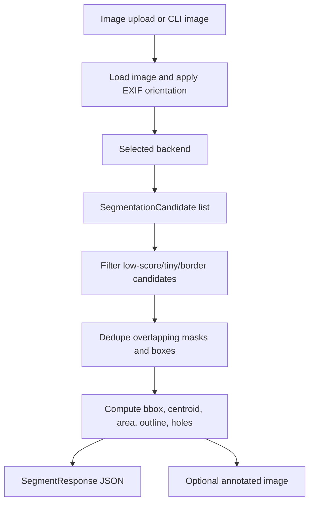

# Architecture And Design Notes

Tool Segmenter is built around one idea: the API should not care which segmentation engine produced the masks. Every backend returns `SegmentationCandidate` objects, and the shared postprocessing layer converts those candidates into the public JSON response.

## Goals

- Detect individual tools and tool bits in a drawer photo.
- Return usable geometry: labels, scores, boxes, centroids, areas, outlines, holes, and optional mask RLE.
- Keep all coordinates in the original image coordinate space.
- Support a cheap local backend for development.
- Support a real SAM3 backend for high-quality masks.
- Keep the code backend-pluggable so local MLX, Roboflow, official Meta SAM3, or another segmenter can be swapped in.

## Data Flow

The important boundary is between the backend and postprocessing:

- Backends know how to call a model or algorithm.
- Postprocessing knows how to normalize, dedupe, and serialize results.

## Core Data Contract

`SegmentationCandidate` lives in `app/backends/base.py`:

- `label`
- `source_prompt`
- `score`
- `bbox_xyxy`
- `mask`
- `refinement_bbox_xyxy`

`mask` is a boolean `HxW` array in original image coordinates. This is the most important invariant. If a backend resizes or crops internally, it must map masks back before returning.

`refinement_bbox_xyxy` is intentionally separate from `bbox_xyxy`. The normal box describes the current mask. The refinement box is a padded region that a SAM-style model can use when the current mask is only partial.

## Backends

### `mock`

The mock backend returns synthetic shapes. It exists so tests and API development do not require SAM3, Roboflow, MLX, or network access.

Use it for:

- API contract tests
- frontend integration while model access is unavailable
- quick local sanity checks

Do not use it to judge segmentation quality.

### `opencv`

The OpenCV backend is the conservative local baseline.

It:

1. Detects the dark drawer mat.
2. Builds foreground seeds from saturated colors and bright/metal-like regions.
3. Groups nearby aligned components into likely tools.
4. Converts each grouped seed into a hull mask.
5. Generates `refinement_bbox_xyxy` by expanding the partial detection and clipping to the drawer mat.

Why it exists:

- It runs locally and quickly.
- It produces useful proposals without external services.
- It gives SAM3 a better crop/box target.
- It provides a fallback when remote or local model backends are unavailable.

Known limits:

- It sees visual evidence, not semantic objects.
- Black tools on a black mat are difficult.
- It can miss black shafts/tips or split one tool into parts.
- It can merge nearby objects when their visible components align.

### `opencv_bg_refined`

This is an experimental variant of OpenCV.

It:

1. Estimates the drawer mat background.
2. Inverts "background-like" pixels inside each refinement region.
3. Runs crop-local GrabCut seeded by the OpenCV foreground mask.
4. Keeps the refined mask only if guardrails say it did not grow too aggressively.

Decision: this is not the default because it can recover more of partial tools, but it can also bridge adjacent tools in dense areas. Keeping it separate lets us compare it without weakening the conservative baseline.

### `roboflow_sam3`

This is the currently working SAM3 path.

It:

1. Reads `ROBOFLOW_API_KEY` or `ROBOFLOW_API_KEY_FILE`.
2. Sends a base64 image and text prompts to `https://serverless.roboflow.com/sam3/concept_segment`.
3. Receives polygon masks from Roboflow SAM3.
4. Converts polygons to boolean masks.
5. Filters detections to the inferred work surface.
6. Returns normal `SegmentationCandidate` objects.

`ROBOFLOW_FILTER_MODE=auto` is the default. In auto mode, the backend first checks whether the photo contains a large light square work surface, such as the 556 mm white board used for calibrated measurements. If detected, SAM3 candidates are kept only when their masks overlap that board. If no light board is found, the backend falls back to the dark drawer mat detector used by the OpenCV backend. Set `ROBOFLOW_FILTER_MODE=light_board`, `drawer_mat`, or `none` to force one path.

Why hosted Roboflow SAM3 is used:

- It runs today with only an API key.
- It returns real SAM3 masks and polygons.
- It avoids forcing every user to download and configure a large local model.

Security decision:

- API keys are never committed.
- The README and `CODEX.md` recommend `ROBOFLOW_API_KEY_FILE` outside the repo.

### `sam3_multiview`

This is the future local/refinement architecture.

It currently exports and prepares the inputs that a local SAM3 adapter should consume:

- original image
- CLAHE luminance image
- grayscale CLAHE image
- color-boosted image
- background-residual image
- OpenCV proposal regions
- padded refinement crops

Why multiview exists:

- Color handles, shiny shafts, and black-on-black tools need different visual treatments.
- SAM3 can benefit from being asked the same region through multiple views.
- Consensus across views should be stronger than trusting one manipulated image.

The local SAM3 call is not hard-coded because the exact installed SAM3/MLX API can vary. The repo now has the orchestration shape; the next implementation step is mapping `Sam3MultiViewBackend.segment()` to the installed local model API.

### `sam3_mlx`

This backend is a conservative placeholder for a direct local MLX SAM3 integration. It fails clearly until model files and the actual Python API are present.

## Why Padded Refinement Boxes Matter

OpenCV often detects only the colored handle or shiny shaft. That tight mask is useful evidence, but it may not cover the whole physical tool.

So the code expands each detection:

- vertical tools get more horizontal padding
- horizontal bits get more vertical padding
- small skinny objects get extra room
- the expanded box is clipped to the drawer mat

SAM3 should receive the expanded box, not only the tight OpenCV mask.

## Work-Surface Filtering

SAM3 can detect relevant-looking tools outside the intended work area if the whole photo includes nearby objects. For the drawer sample, the photo includes surrounding bench/floor content. For calibrated photos, the target is the white measurement board rather than a dark drawer mat.

To keep results focused:

1. Auto mode tries to detect a large low-saturation, high-value square board.
2. If that board is found, each SAM3 candidate mask is measured against the board polygon.
3. If no board is found, OpenCV estimates the dark drawer mat and measures candidates against it.
4. Candidates with too little mask overlap on the selected surface are removed.

This is a pragmatic domain constraint: the target use case is "tools on this surface," not "all tools in the entire photo."

## Postprocessing

`app/postprocess.py` handles reusable geometry:

- resize metadata
- mask-to-box conversion
- contour extraction
- area
- centroid
- box IoU
- mask IoU
- deduplication
- response-object conversion

Deduplication sorts by score and removes overlapping candidates. When scores are close, it prefers more specific labels over generic ones. For example, `blue handle screwdriver` should beat `hand tool` if both masks cover the same object.

## API Shape

`POST /segment-tools` accepts multipart form data:

- `image`
- optional `prompts`
- optional `min_score`
- optional `return_masks`
- optional `return_contours`
- optional `max_image_side`

It returns:

- image dimensions
- backend name
- objects
- timing

`POST /annotate-tools` runs the same segmentation path and returns an overlay PNG.

`GET /health` returns backend availability and model/key status.

## Coordinate Decisions

All public coordinates are in original image space after EXIF orientation is applied:

- `bbox_xyxy`
- `bbox_xywh`
- `bbox_normalized_xyxy`
- `centroid_xy`
- `outline`
- `holes`
- `refinement_bbox_xyxy`

The code uses `ImageOps.exif_transpose()` so iPhone images display and segment in the same orientation humans see.

## Public Sample Image Decision

The checked-in sample image is not the raw iPhone file. It was:

1. EXIF-transposed to the visible orientation.
2. Converted to RGB.
3. Saved as a new JPEG without EXIF/GPS metadata.

This keeps the public repo useful without publishing location metadata.
